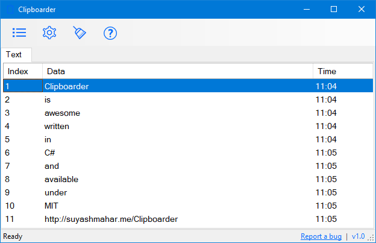
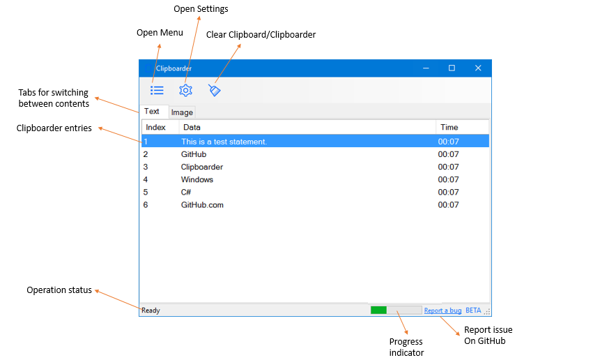
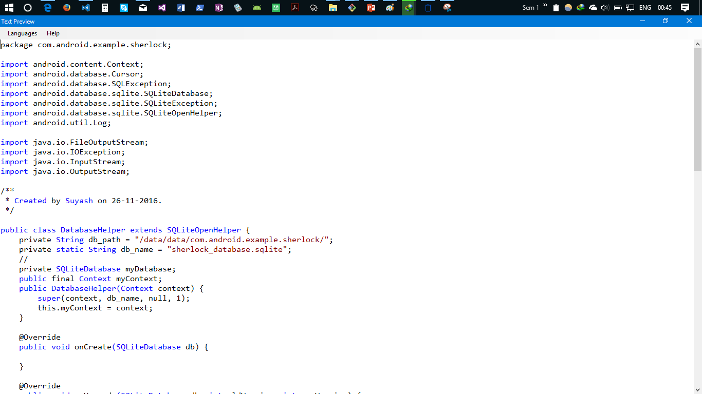

<image src="Images/clipboarder_banner.png">

# Clipboarder
**Clipboarder** is a clipboard management tool for Windows written in C# using .NET framework 4.0.  

Grab latest release (v1.0) of Clipboarder from [here](https://github.com/suyashmahar/Clipboarder/releases/tag/v1.0).

## Features:
1. Clipboard management for text based content.
2. Ability to save contents of Clipboarder to database using password.
3. Ability to access content in hierarchical order using customizable  keyboard shortcut, default: <kbd>Ctrl</kbd> + <kbd>Shift</kbd> + <kbd>NumberKeys</kbd>.
4. Identification of multiple URLs in text content (turned off by default).
5. Syntax Highlighting for languages defined in SHLs directory.
6. Support for UTF content.

## Releases

## Releases
Latest release for Clipboarder is 1.0.0.  Release notes and binary for this release is [here](https://github.com/suyashmahar/Clipboarder/releases/tag/v1.0).  
* [__1.0.0__](release-notes/ver-1.0.0.md)  
Version 1.0 of Cliboarder brings lots of new features, some of them are:
    * Starting Clipboarder with Windows
    * Installation support for SHL files
    * Several UX improvements
    * Moving to NSIS based installation scripts for easy installation

* __0.9.0-beta__  
0.9.0-beta release of Clipboarder brings first release of Clipboarder since moving to GitHub. Clipboarder currently does not include installer. Release notes and binary for this release is [here](https://github.com/suyashmahar/Clipboarder/releases/tag/v0.9.0.0Beta).

## Screenshots  
  

#### UI details  
  

## Syntax Highlighting
Clipboarder uses cutom `RichTextBox`, `SyntaxHighlightingTextBox` to highlight text. Keywords for coloring are stored in XML files within the 'SHLs' directory.

  

### Note:
* Language name displayed in Text Preview are same as XML file in the SHLs directory.
* XML file should follow pattern similar to that of `sample-java.xml`
* Coloring of keywords in `SyntaxHighlightingTextBox` is in the order they are defined in XML file.
